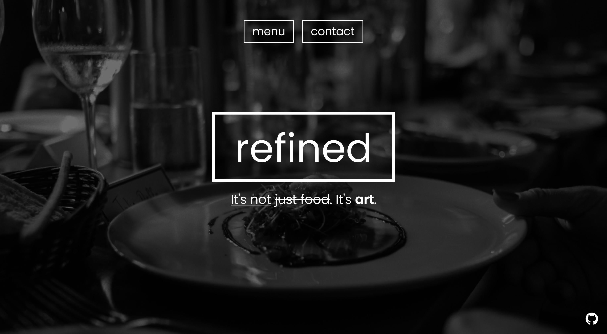
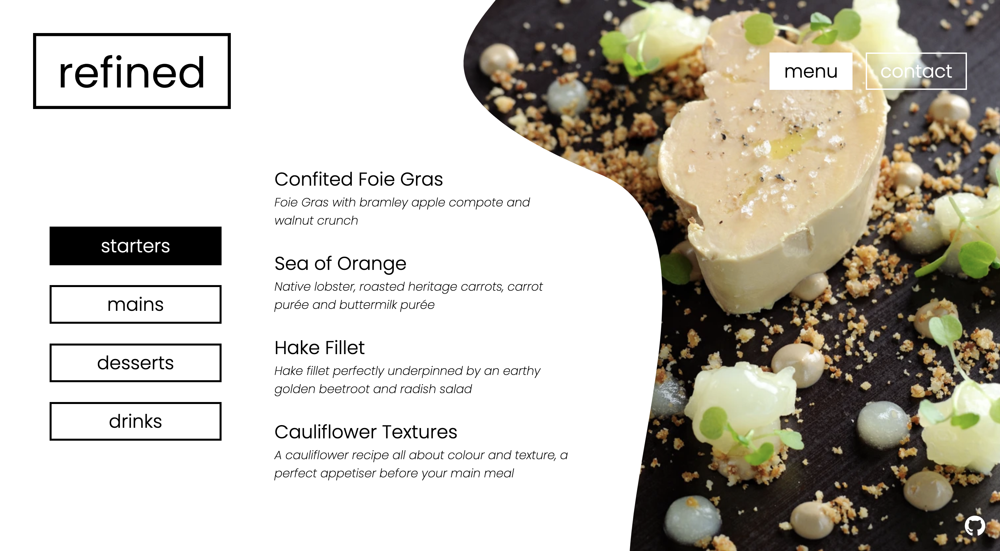

# Restaurant Page - "refined"

  
  

<h3 align="center">
<a href="https://baheerpayab.github.io/restaurant-page/">Live Demo</a>
</h3>

### Project

The third project of the Odin Project Javascript Course. This project wanted us to dynamically render a restaurant page using JavaScript alone. This was also our first project using webpack.

Although this project could have been rather simple, just practicing DOM manipulation , I still wanted to try and make a somewhat fun and interesting site. I added in features that I've never tried before on each page, those being: the 'slideshow' of elements on the home page; background-image change when hovering on the menu items, as well as designing vector graphics for a more sophisticated background; and the hover-revealing divs in the contact page.

#### Learned:

- JS DOM Manipulation
- Webpack
- Config files

### Built With

* HTML
* CSS
* JavaScript
